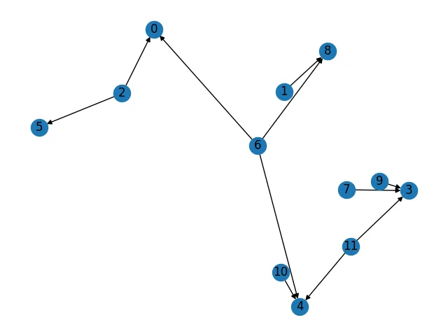

# LISA - HyperLogLog based approximation framework for very big Datasets

> **If it looks like a duck, swims like a duck, and quacks like a duck, then it probably is a duck.**

>  *This project is greatly inspired by the implementation of the HLL algorithm in the Julia library:
> https://github.com/jakobnissen/Probably.jl/blob/master/src/hyperloglog/hyperloglog.jl* 

## Introduction

HyperLogLog definition from the Wiki [1]:
> The basis of the HyperLogLog algorithm is the observation that the cardinality of a multiset of uniformly distributed random numbers can be estimated by calculating the maximum number of leading zeros in the binary representation of each number in the set. If the maximum number of leading zeros observed is n, an estimate for the number of distinct elements in the set is 2**n.[2]

> In the HyperLogLog algorithm, a hash function is applied to each element in the original multiset to obtain a multiset of uniformly distributed random numbers with the same cardinality as the original multiset. The cardinality of this randomly distributed set can then be estimated using the algorithm above.

> The simple estimate of cardinality obtained using the algorithm above has the disadvantage of a large variance. In the HyperLogLog algorithm, the variance is minimized by splitting the multiset into numerous subsets, calculating the maximum number of leading zeros in the numbers in each of these subsets, and using a harmonic mean to combine these estimates for each subset into an estimate of the cardinality of the whole set.[3]

## HyperLogLog as an approximation of datasets

The important part of the algorithm described in Introduction is a collection of subsets that we are using to calculate leading zeros.

Lets look at the process of collecting numbers of leading zeros a little bit closer.

In most implementations of HLL ([4], [5]) this collection presented as an array (vector) and named as registers. The size of the registers vector is usually power of 2. For example, Redis implementation [4] is using 2**13 = 8192 elements.

Here is an algorithm to build registries (regvector) using Python as a pseudo-code:

```
# Fill registers with zeros
# k is the power of 2 in the formula for the registers size
registers = = [0] * 2**k

for entry in dataset:
  # Calculate hash for each dataset entry
  h_entry = hash_fn(entry)

  # Calculate index of the registry as the first k bits from the h_entry
  # As mentioned Redis takes 13 leading bits
  reg_idx = get_reg_idx(h_entry, k)

  # Count longest sequence of running zeros
  z_num = zero_count(h_entry)

  # Update registers, if calculated z_num greater than 
  # current value in the registers, replace it with z_num
  if z_num > registers[reg_idx]:
    registers[reg_idx] = z_num
  # Or without using if statement
  #  registers[reg_idx] = max(register[reg_idx], z_num)
```

After running this algorithm each element of registers holds a max number of running zeros for each subset of dataset. The subset is associated with k leading bits of the hash value for the elements that belong to this subset.

The registers building algorithm has a few very useful properties:

1. It is an idempotent — it means that running this algorithm against the same dataset will not change the outcome;
2. It creates a single presentation for each dataset — if two registers vectors are different, then the corresponding datasets are different. But this is one way comparison. The same registers for the datasets do not guaranty equivalence of those datasets. So, we have a case of false positives, but we do not have a false negatives when we are comparing datasets using HLL. The datasets with different registers are not equal.
3. (not very useful) The relation between registers and a cardinality of a dataset is not exactly straightforward. Depending on the size of the dataset the calculation formula is needed to be adjusted. It also is not very consistent for different types of data in datasets and even different types of a distribution of those data. These discrepancies are hard to correct in generic way and they are not corrected in the current implementations of HLL.

## Hll operations

Most HLL implementation provide support for following operations:

ADD — adds an element from a dataset to the registers (it is an internal part of the algorithm described above);

MERGE — is using almost the same algorithm as ADD with a slight modification.

```
# dataset_1 - registers for dataset 1
# dataset_2 - registers for dataset 2
# out - registers for resulting dataset

def merge(dataset_1, dataset_2):
  # Initialize resulting registers
  out = [0] * 2**k
  for i in range(dataset_1.size() - 1):
    # Set out[i] to the max of elements in dataset_1[i] and dataset_2[i]
    out[i] = max(dataset_1[i], dataset_2[i]) 
```
It is obvious that the sizes of all three registers vectors should be the same.

MERGE operation is lossless.

COUNT — is the heart of the HLL, it calculates cardinality of the dataset based on the values in the registers.

So, the union is the merge command from HyperLogLog. The original command updates (mutates) registers of a hll, the new implementation makes this operation immutable. It doesn’t change the registers of input datasets but creates new registers and a new HLL as an output. It works the same way as the merge command in Redis HLL.

The **intersect** command is missing in all implementations that I aware of. And there are reasons for this absence. The “obvious” solution to replace max in union with min in intersect doesn’t work. Applying cardinality command to intersection obtained with this “solution” will always return greater estimate of the cardinality — in average around 2 times greater.

It is not enough just to get min of two values in the intersection of two HLLs, we need to modify the result regvector as well. And this is exactly the case when one size doesn’t fit all cases.

So, it’s not a solution. Remember, each register in the registers vector serves all data items from a dataset that have a hash value that starts with the same k bits. These k bits present an identifier of the register. So, potentially any hash with given k bits and number of running zeros less than current number assigned to the register could be there.

On the other hand, the acquired result for registers in the intersection is still holds all properties of the HLL that we mentioned early:

1. It is an idempotent.
2. It creates a single presentation for each resulting dataset.
3. And, yes — The relation between registers and a cardinality of a dataset is not exactly straightforward.

## Fixing limitations of current implementations of HLL

Even without any changes current implementations of HLL are good enough. The only intersect creates some inconvenience, but it could be resolved with inclusion/exclution formula:

    card(intersect(A, B)) = (card(A) + card(B)) - card(union(A, B))

This way we can get cardinality of intersection of A and B datasets, but cannot get the approximated HLL set.

The solution terned out to be very simple. All we need to do is to slightly uprade the data structures of the registers.

From this point we are switching to Julia. The reason is simple - Julia is fast and it has the same convinient features (at least in our context) as Python.

So, here is new data structure for the registers, we'll start to call them **counters**.

```
struct HllSet{P}
    # This is the most important change, we are replacing
    # integer (the max number of running zeros) with 
    # BitVector.
    # This replacement allows us keep all numbers of running
    # zeros for all regesters (we call them bins)

    counts::Vector{BitVector}

    function HllSet{P}() where {P}
        validate_P(P)
        n = calculate_n(P)
        counts = create_bitsets(n)
        return new(counts)
    end

    # This is what Copilot recommend us to do. We think it's not bad.
    function validate_P(P)
        isa(P, Integer) || throw(ArgumentError("P must be integer"))
        (P < 4 || P > 18) && throw(ArgumentError("P must be between 4 and 18"))
    end

    function calculate_n(P)
        return 1 << P
    end

    function create_bitsets(n)
        return [falses(64) for _ in 1:n]
    end
end
```

With BitVector, we defining max number of running zeros as the bigest index in the BitVector that holds "1".



